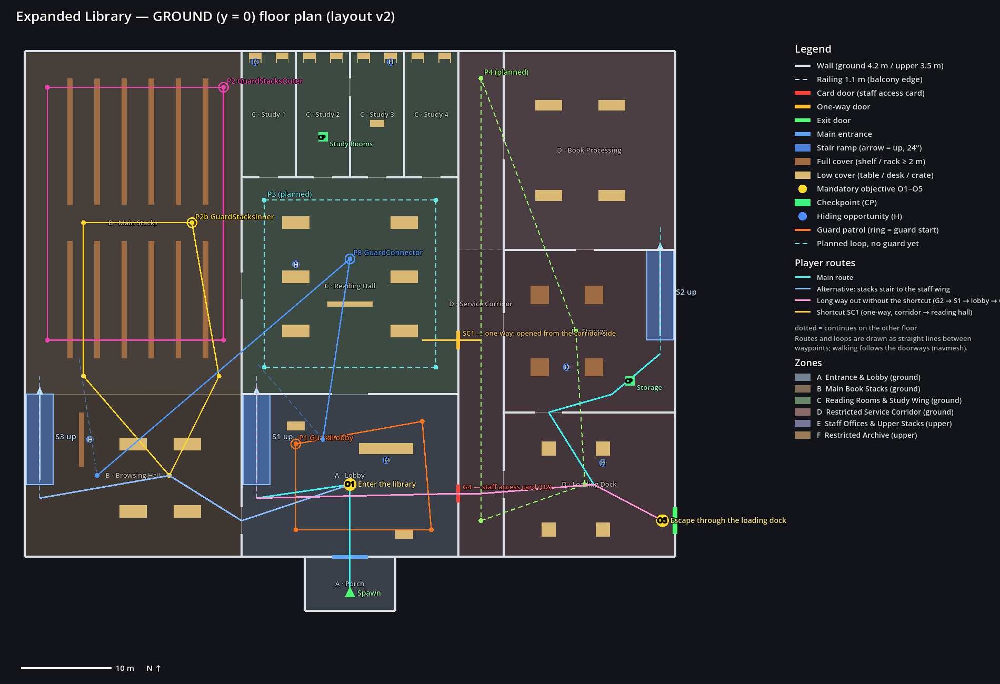
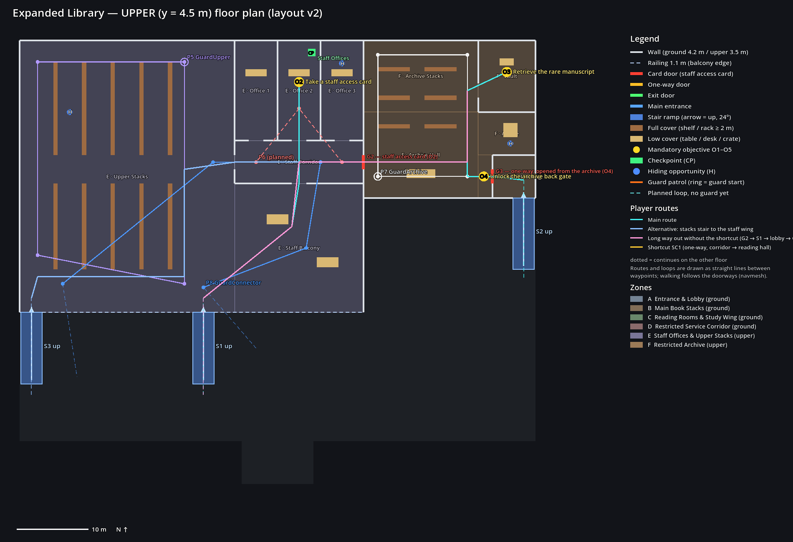

# Expanded Library — Layout Design (v2)

The design of the second, larger map: a two-floor university library with six major zones. It is a separate scene (`scenes/level/expanded_library.tscn`) next to the tutorial, which is unchanged.

**Status:** graybox, with simple boxes and placeholder colours, chosen from the main menu (Phase 2), with six guards (Phase 3) and the full five-objective mission (Phase 4): access doors, a one-way return shortcut, the exit, three checkpoints. Difficulty balancing and the 20–30 minute target are the next phase. Hiding spots and the unguarded patrol loops are still **planned locations** (markers).

**Plans:** [`v2/layout_ground.png`](v2/layout_ground.png) and [`v2/layout_upper.png`](v2/layout_upper.png), drawn from the layout data. Screenshots of the built level are in [`v2/`](v2/), and of the mission with its HUD in [`v2/mission/`](v2/mission/). Earlier versions: [`v0/`](v0/), [`v1/`](v1/).

| | |
|---|---|
|  |  |

## Where the layout lives

| File | Role |
|---|---|
| `tools/expanded/expanded_layout.gd` | **The layout data**, the single source of truth: zones, floors, walls with openings, stairs, cover, objectives, gates, patrol loops, hiding spots, routes, probe points |
| `tools/expanded/draw_layout.gd` | draws the two floor plans from the data |
| `tools/expanded/build_expanded_graybox.gd` | builds the scene and bakes its navmesh from the data |
| `tools/expanded/capture_graybox.gd` | screenshots of the built scene (top views, navmesh, eye-height views) |
| `tools/expanded/capture_mission.gd` | screenshots of the mission with the HUD, one per step |
| `scenes/level/expanded_library.tscn`, `expanded_library_navmesh.tres` | the built level (layout, guards, mission) |
| `tests/expanded_graybox_tests.gd`, `expanded_ai_tests.gd`, `expanded_mission_tests.gd` | the layout, guard and mission tests (part of the suite) |

While the map is a graybox, **change the data and rebuild; don't hand-edit the scene**:

```
godot --headless --path . --script res://tools/expanded/build_expanded_graybox.gd
godot --path . --script res://tools/expanded/draw_layout.gd -- --out=docs/expanded/vN
godot --path . --resolution 1600x1000 --script res://tools/expanded/capture_graybox.gd -- --out=docs/expanded/vN
```

The last two need a display. A virtual one works, for example `xvfb-run`.

## Coordinates and dimensions

x is east and z is south, so north (−z) is up on the plans. The ground floor stands on y = 0 and the upper floor on y = 4.5.

| Item | Size | Why |
|---|---|---|
| Ground-floor walls | 4.2 m (up to the underside of the upper slab) | |
| Upper slab | 0.3 m thick, top at 4.5 m | |
| Upper-floor walls | 3.5 m | |
| Balcony railings | 1.1 m | the player can't jump, so a railing is a hard edge |
| Wall thickness | 0.3 m | |
| Doors | 2.0 m wide, header at 2.6 m | navmesh agent radius 0.5 m → 1 m of navmesh through a door |
| Arches | 3–4 m | |
| Corridors | ≥ 3 m (service corridor 4.7 m) | |
| Shelf aisles | 2.4 m (upper stacks 3.4 m) | |
| Stairs | 3 m wide ramps, rise 4.5 m over 10 m (24°) | the player has no step-up; the navmesh accepts up to 45° |
| Space under a ramp | filled with ten stepped blocks | no crawl space and no unreachable navmesh island; it reads as steps from the side |
| Open side of a ramp | balustrade of five vertical panels, 1.0 m above the ramp, on the ramp's edge | vertical faces: the v0 panel, turned with the slope, leaned past the foot of the ramp and caught guards (v1) |

The player is a 0.35 m × 1.8 m capsule and walks at 3.5 m/s. Guards are 0.4 m × 1.8 m. The navmesh agent is 0.5 m in radius and 1.75 m tall. The navmesh uses the same settings as the tutorial's: static colliders on layer 1, cell 0.25 m, region minimum size 8.

## Zones

| Zone | Floor | Footprint (m) | Area | Rooms | Role |
|---|---|---|---|---|---|
| **A** Entrance & Lobby | ground | 24 × 18 + porch 10 × 6 | 492 m² | Porch (spawn), Lobby (circulation desk, **S1 main stair**) | start and **O1**; hub between B, C and D; overlooked by the staff balcony |
| **B** Main Book Stacks | ground | 24 × 56 | 1,344 m² | Main Stacks (six 2.2 m shelf rows, cross aisle), Browsing Hall (tables, **S3 stacks stair**) | quiet west flank; second way upstairs |
| **C** Reading Rooms & Study Wing | ground | 24 × 38 | 912 m² | Reading Hall (six tables, low bookcase), Study 1–4 (carrels; Study 2 and 3 linked) | the middle of the ground floor; checkpoint *Study Rooms* |
| **D** Restricted Service Corridor | ground | 24 × 56 | 1,344 m² | Service Corridor, Book Processing, Storage (**S2 staff stair**), Loading Dock (**exit**) | restricted (card door G4); return route and exit (**O5**) |
| **E** Staff Offices & Upper Stacks | upper | 48 × 38 | 1,824 m² | Upper Stacks (five shelf rows), Staff Balcony (over the reading hall, railing over lobby and browsing hall), Staff Corridor, Office 1–3 | **O2** (Office 2) |
| **F** Restricted Archive | upper | 24 × 22 | 528 m² | Archive Hall, Archive Stacks, Vault, Alcove, Staff Stair Landing | **O3** (Vault) behind the card gate G2; **O4** (back gate G3) |

The upper floor covers the north of B, all of C and the north of D. The lobby, the browsing hall, storage and the loading dock are single-height, open to the balcony railing or to the roof.

## Connections

| Between | Opening | Type |
|---|---|---|
| Porch → Lobby (A) | Main Entrance, 4 m | entrance |
| A ↔ B | Stacks Arch (Lobby), 3 m | arch |
| A ↔ C | Reading Hall Doors, 4 m | arch |
| A ↔ D | **Lobby Staff Door G4**, 2 m | card door (staff access card, O2) |
| B ↔ C | Stacks Arch (Reading Hall), 3 m | arch |
| D → C | **Service Shortcut SC1**, 2 m | one-way door, opened from the corridor side (optional) |
| C (hall) ↔ Study 1–4 | four 2 m doors; Study 2 ↔ 3 door | door |
| D (corridor) ↔ Processing / Storage / Dock | 2 m / 2 m / 3 m; Processing ↔ Storage, Storage ↔ Dock | door |
| D → outside | **Loading Dock Exit**, 3 m | the exit (ExitDoor): sealed until O4, then **O5** |
| A ↔ E | **S1 Main Stair** (lobby → upper stacks) | stair |
| B ↔ E | **S3 Stacks Stair** (browsing hall → upper stacks) | stair |
| D ↔ F | **S2 Staff Stair** (storage → staff stair landing) | stair |
| Upper stacks / balcony ↔ staff wing (E) | **Staff Door (Stacks) G1b**, **Staff Wing Door G1a** | open doors (v2; planned as gates in v0/v1) |
| Staff corridor (E) ↔ archive (F) | **Archive Front Gate G2** | card door (staff access card, O2): the only way in |
| Archive (F) → staff stair landing | **Archive Back Gate G3** | one-way door, opened from the archive side: **O4**, the return shortcut |
| Archive hall ↔ vault (F) | Vault Door | door |

Every zone connects to at least two others: A–B, A–C, A–D, A–E, B–C, B–E, C–D, D–F, E–F.

## Routes and approaches

**Main route** (cyan on the plans), 197 m along the navmesh:
1. Porch → lobby: **O1** (enter the library).
2. Lobby → **S1** up → balcony → **G1a** → staff corridor → Office 2: **O2** (staff access card; checkpoint *Staff Offices* at the back of the office).
3. Staff corridor → **G2** (opened with the card) → archive hall → vault: **O3** (rare manuscript).
4. Archive hall → **G3** (opened from inside): **O4**.
5. Staff stair landing → **S2** down → storage (checkpoint *Storage*) → loading dock → exit door: **O5**.

**Two approaches:**

| Toward | Approach 1 | Approach 2 | Also |
|---|---|---|---|
| the upper floor | S1 from the lobby (guarded, overlooked by the balcony) | S3 from the browsing hall (quiet back stair) | S2 from storage, once G4 is open (card) |
| the staff wing (O2) | G1a from the balcony | G1b from the upper stacks | |
| the restricted archive (O3) | G2 front gate from the staff corridor (card) | — G3 is locked from outside | |
| the exit, from the archive | **G3 → S2 → dock (the shortcut)** | G2 → staff wing → S1 → lobby → G4 → dock (the long way) | |

**The shortcut's benefit** (measured on the navmesh by `expanded_graybox_tests`): vault → exit is **66 m through G3** against **111 m** the long way (41% shorter), and the long way passes the archive guard, the staff corridor, the balcony, the lobby guard and the lobby again. A player who skips O4 can't escape at all: the exit stays sealed.

**SC1** (optional): a service door between the corridor and the reading hall that opens only from the corridor side. Once open, it is a quick way between the service corridor and the reading hall.

## Doors and progression

Access doors are `AccessDoor` nodes (`scripts/systems/objectives/access_door.gd`, an `Interactable` like the card and the exit). A closed door is a solid panel on the world layer that is **not baked** into the navmesh: guards have keys (collision exceptions) and keep their routes through the doorways; for the player and for sight and hearing it is a wall. Opening it removes the panel. Doors are part of the checkpoint snapshot.

| Door | Opens | When |
|---|---|---|
| G2 Archive Front Gate | with the staff access card (O2), from either side | stays open |
| G4 Lobby Staff Door | with the staff access card (O2), from either side | stays open |
| G3 Archive Back Gate | from the archive side only | completes **O4** (at once, or when O4 comes up if opened before the manuscript) |
| SC1 Service Shortcut | from the corridor side only | optional |
| Loading Dock Exit | the exit door: escape once O4 is done (O5 ACTIVE) | ends the level (WIN) |

The tests rebake the level with the closed doors as blockers to prove each stage:

| Stage | Closed | Reachable | Not reachable |
|---|---|---|---|
| Start | G2, G4, G3 (from outside), SC1 | A, B, C, the upper stacks, the staff wing and **O2** | service corridor and dock, the landing, the archive (O3, O4), the exit |
| With the card | G3 (from outside), SC1 | **O3**, **O4**, the dock and the exit (the long way) | — |
| Back gate open | SC1 | the shortcut out of the archive | — |

With G2 closed the archive cannot be entered at all; G3 is its only other door and opens from inside.

## Objectives

| # | Id | Objective | Zone, where | Stand at |
|---|---|---|---|---|
| O1 | `enter_library` | Enter the library | A, lobby (trigger over the room) | (0, 0, 20) |
| O2 | `take_card` | Take a staff access card | E, Office 2 desk | (3, 4.5, −22.2) |
| O3 | `take_manuscript` | Retrieve the rare manuscript | F, vault pedestal | (32, 4.5, −23.6) |
| O4 | `unlock_shortcut` | Unlock the archive back gate | F, G3 (archive side) | (28.8, 4.5, −9) |
| O5 | `escape` | Escape through the loading dock | D, east wall door | (34.6, 0, 24) |

The spawn is (0, 0.05, 32) on the porch, facing north.

## Checkpoints

| Checkpoint | Where | Why there |
|---|---|---|
| Study Rooms | C, Study 2 (−3, 0, −18.5) | a quiet pocket off the reading hall |
| Staff Offices | E, back of Office 2 (4.8, 4.5, −26.3) | after the climb; more than 14 m (guard sight range) from the staff corridor |
| Storage | D, storage near the S2 foot (31, 0, 8.5) | on the way out, after the shortcut |

No guard has a respawn point in view during the patrols (`expanded_ai_tests`, and the soak in `v2/soak/`).

## Guards and patrol loops (v1, v2)

Six guards, using the existing guard scene and AI (PATROL / INVESTIGATE / CHASE), each walking a loop from the layout data. The tests and a 900 s soak (`v1/soak/report.md`) show every loop completes with no stuck events.

| Loop | Guard | Zone | Points | Length | Watches |
|---|---|---|---|---|---|
| P1 Lobby | GuardLobby | A | 4 | 51 m | the lobby, the S1 foot and the staff door G4. The spawn and porch stay unseen |
| P2 Main Stacks | GuardStacksOuter | B | 4 | 99 m | the outer aisles of the main stacks |
| P2b Stacks Inner | GuardStacksInner | B | 5 | 76 m | the cross aisle, an inner aisle and the browsing hall (S3 foot) |
| P5 Upper Stacks | GuardUpper | E | 4 | 101 m | both stair tops (S1, S3) and the stacks door G1b |
| P7 Archive | GuardArchive | F | 4 | 59 m | the archive hall between the front gate G2 and the back gate G3, and the stacks |
| P8 Connector | GuardConnector | A → E → B → C | 8 | 180 m (v2: 184 m) | reading hall → lobby → **up S1** → balcony → staff corridor (G1a) → upper stacks (G1b) → **down S3** → browsing hall → main stacks → reading hall. v2: its staff-corridor point moved from x 3 to x 6, off the line through the Office 2 door |

Planned loops without a guard yet: P3 Reading Hall, P4 Service Corridor (the restricted zone, for the mission phase) and P6 Staff Corridor. They stay as PatrolRoute nodes under `Layout/PlannedPatrols`. The guarded loops are under `Guards/` next to their guards, as in the tutorial. F3 shows all of them in a debug run.

## Cover and hiding

- **Full cover** (≥ 2 m): 33 pieces — B 13 shelves, D 4 storage racks, E 10 shelves, F 6 archive shelves.
- **Low cover** (0.75–1.3 m): 31 pieces — tables, desks, crates, the circulation desk, planters.
- **Carrels:** 8 study carrels (desk and 1.5 m side panels) in Study 1–4.
- **Planned hiding spots** (`Layout/HidingSpots`): two study carrels, a reading table, the browsing-hall shelf, the circulation desk, a storage rack, a dock crate, an upper-stacks aisle, the Office 3 desk, the archive alcove.

## Design notes and open points for later phases

- **Cross-floor sight lines:** the balcony railing (1.1 m) lets upper-floor guards see into the lobby and browsing hall. That is intended (Phase 3 tests).
- **Hearing through the slab:** walls and floors halve hearing range (the existing rule); a sprint directly overhead is heard, a walk is not (Phase 3 tests).
- **Access doors** need no new physics layer: the panel is world geometry outside the navmesh region, and guards get collision exceptions with it (audit R8 resolved this way in Phase 4).
- **Service corridor (zone D) is unguarded** in v2: P4 is still planned. Balancing decides whether it gets a guard.
- **Target time:** the main route is 197 m along the navmesh (the tutorial's shortest route: 102 m) with five objectives instead of one card. The 20–30 minute target is set in the balancing phase and confirmed by timed playtests.
