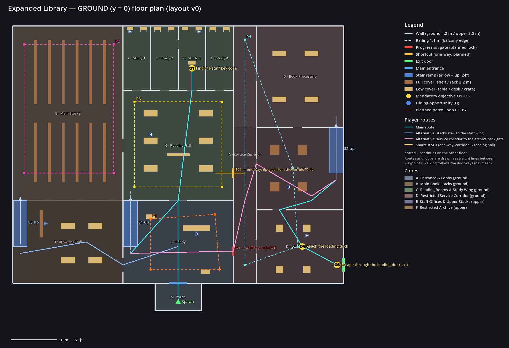
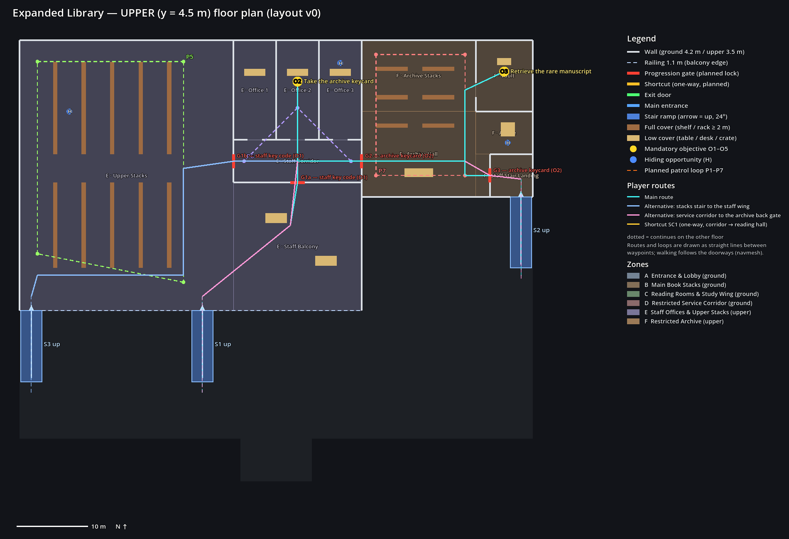

# Expanded Library — Layout Design (v0)

The design of the second, larger map: a two-floor university library with six major zones. It is a separate scene (`scenes/level/expanded_library.tscn`) next to the tutorial, which is unchanged.

**Status:** graybox, with simple boxes and placeholder colours. Objectives, gates, patrols and hiding spots are **planned locations** (markers), not working gameplay yet. Map selection and the mission come in later phases.

**Plans:** [`v0/layout_ground.png`](v0/layout_ground.png) and [`v0/layout_upper.png`](v0/layout_upper.png), drawn from the layout data before the scene was built. Screenshots of the built graybox are in [`v0/`](v0/).

| | |
|---|---|
|  |  |

## Where the layout lives

| File | Role |
|---|---|
| `tools/expanded/expanded_layout.gd` | **The layout data**, the single source of truth: zones, floors, walls with openings, stairs, cover, objectives, gates, patrol loops, hiding spots, routes, probe points |
| `tools/expanded/draw_layout.gd` | draws the two floor plans from the data |
| `tools/expanded/build_expanded_graybox.gd` | builds the scene and bakes its navmesh from the data |
| `tools/expanded/capture_graybox.gd` | screenshots of the built scene (top views, navmesh, eye-height views) |
| `scenes/level/expanded_library.tscn`, `expanded_library_navmesh.tres` | the built graybox |
| `tests/expanded_graybox_tests.gd` | the graybox tests (part of the suite) |

While the map is a graybox, **change the data and rebuild; don't hand-edit the scene**:

```
godot --headless --path . --script res://tools/expanded/build_expanded_graybox.gd
godot --path . --script res://tools/expanded/draw_layout.gd -- --out=docs/expanded/vN
godot --path . --resolution 1600x1000 --script res://tools/expanded/capture_graybox.gd -- --out=docs/expanded/vN
```

The last two need a display. A virtual one works, for example `xvfb-run`.

## Coordinates and dimensions

x is east and z is south, so north (−z) is up on the plans. The ground floor stands on y = 0 and the upper floor on y = 4.5.

| Item | Size | Why |
|---|---|---|
| Ground-floor walls | 4.2 m (up to the underside of the upper slab) | |
| Upper slab | 0.3 m thick, top at 4.5 m | |
| Upper-floor walls | 3.5 m | |
| Balcony railings | 1.1 m | the player can't jump, so a railing is a hard edge |
| Wall thickness | 0.3 m | |
| Doors | 2.0 m wide, header at 2.6 m | navmesh agent radius 0.5 m → 1 m of navmesh through a door |
| Arches | 3–4 m | |
| Corridors | ≥ 3 m (service corridor 4.7 m) | |
| Shelf aisles | 2.4 m (upper stacks 3.4 m) | |
| Stairs | 3 m wide ramps, rise 4.5 m over 10 m (24°) | the player has no step-up; the navmesh accepts up to 45° |
| Space under a ramp | filled with ten stepped blocks | no crawl space and no unreachable navmesh island; it reads as steps from the side |
| Open side of a ramp | 1.0 m handrail panel | |

The player is a 0.35 m × 1.8 m capsule and walks at 3.5 m/s. Guards are 0.4 m × 1.8 m. The navmesh agent is 0.5 m in radius and 1.75 m tall. The navmesh uses the same settings as the tutorial's: static colliders on layer 1, cell 0.25 m, region minimum size 8.

## Zones

| Zone | Floor | Footprint (m) | Area | Rooms | Role |
|---|---|---|---|---|---|
| **A** Entrance & Lobby | ground | 24 × 18 + porch 10 × 6 | 492 m² | Porch (spawn), Lobby (circulation desk, **S1 main stair**) | start; hub between B, C and D; overlooked by the staff balcony |
| **B** Main Book Stacks | ground | 24 × 56 | 1,344 m² | Main Stacks (six 2.2 m shelf rows, cross aisle), Browsing Hall (tables, **S3 stacks stair**) | quiet west flank; second way upstairs |
| **C** Reading Rooms & Study Wing | ground | 24 × 38 | 912 m² | Reading Hall (six tables, low bookcase), Study 1–4 (carrels; Study 2 and 3 linked) | **O1** (Study 3) |
| **D** Restricted Service Corridor | ground | 24 × 56 | 1,344 m² | Service Corridor, Book Processing, Storage (**S2 staff stair**), Loading Dock (**exit**) | restricted; return route and exit (**O4**, **O5**) |
| **E** Staff Offices & Upper Stacks | upper | 48 × 38 | 1,824 m² | Upper Stacks (five shelf rows), Staff Balcony (over the reading hall, railing over lobby and browsing hall), Staff Corridor, Office 1–3 | **O2** (Office 2) behind the staff doors |
| **F** Restricted Archive | upper | 24 × 22 | 528 m² | Archive Hall, Archive Stacks, Vault, Alcove, Staff Stair Landing | **O3** (Vault) behind the archive gates |

The upper floor covers the north of B, all of C and the north of D. The lobby, the browsing hall, storage and the loading dock are single-height, open to the balcony railing or to the roof.

## Connections

| Between | Opening | Type |
|---|---|---|
| Porch → Lobby (A) | Main Entrance, 4 m | entrance |
| A ↔ B | Stacks Arch (Lobby), 3 m | arch |
| A ↔ C | Reading Hall Doors, 4 m | arch |
| A → D | **Lobby Staff Door G4**, 2 m | gate (planned: staff key code) |
| B ↔ C | Stacks Arch (Reading Hall), 3 m | arch |
| C → D | **Service Shortcut SC1**, 2 m | shortcut (planned: one-way, opened from the corridor side) |
| C (hall) ↔ Study 1–4 | four 2 m doors; Study 2 ↔ 3 door | door |
| D (corridor) ↔ Processing / Storage / Dock | 2 m / 2 m / 3 m; Processing ↔ Storage, Storage ↔ Dock | door |
| D → outside | **Loading Dock Exit**, 3 m | exit (closed door panel; escape is an interaction later) |
| A ↔ E | **S1 Main Stair** (lobby → upper stacks) | stair |
| B ↔ E | **S3 Stacks Stair** (browsing hall → upper stacks) | stair |
| D ↔ F | **S2 Staff Stair** (storage → staff stair landing) | stair |
| Upper stacks / balcony ↔ staff wing (E) | **Staff Door (Stacks) G1b**, **Staff Wing Door G1a** | gates (planned: staff key code) |
| Staff corridor (E) ↔ archive (F) | **Archive Front Gate G2** | gate (planned: archive keycard) |
| Staff stair landing ↔ archive (F) | **Archive Back Gate G3** | gate (planned: archive keycard) |
| Archive hall ↔ vault (F) | Vault Door | door |

Every zone connects to at least two others: A–B, A–C, A–D, A–E, B–C, B–E, C–D, D–F, E–F.

## Routes and approaches

**Main route** (cyan on the plans), 273 m along the navmesh:
1. Porch → lobby → reading hall → Study 3: **O1** (staff key code).
2. Lobby → **S1** up → balcony → **G1a** → staff corridor → Office 2: **O2** (archive keycard).
3. Staff corridor → **G2** → archive hall → vault: **O3** (manuscript).
4. Return route: archive → **G3** → staff stair landing → **S2** down → storage → loading dock: **O4**.
5. Exit door: **O5**.

**Two approaches to each step:**

| Toward | Approach 1 | Approach 2 | Also |
|---|---|---|---|
| the upper floor | S1 from the lobby (guarded, overlooked by the balcony) | S3 from the browsing hall (quiet back stair) | S2 from the service corridor |
| the staff wing (O2) | G1a from the balcony | G1b from the upper stacks | |
| the restricted archive (O3) | G2 front gate from the staff corridor | G3 back gate via the service corridor (G4) and S2 | |
| the exit, from the archive | G3 → S2 → dock (back way) | G2 → staff wing → S1 → lobby → G4 → dock (front way) | |

**Planned shortcut SC1:** a service door between the corridor and the reading hall. It opens only from the corridor side, so once the player has been through the service corridor, it's a quick way back to the reading hall and lobby.

## Progression gates (planned locks)

The doorways are open in the graybox. The mission phase locks them; the tests already rebake the level with them closed, to prove the progression works:

| Stage | Locked | Reachable | Not reachable |
|---|---|---|---|
| Start | G1a, G1b, G4, G2, G3, SC1 | A, B, C, upper stacks and balcony; **O1** | staff wing (O2), service corridor and dock, archive |
| After O1 (staff key code) | G2, G3, SC1 | **O2**; service corridor, dock, S2 and landing | archive (O3) |
| After O2 (archive keycard) | SC1 | **O3**, return route, exit | — |

The **archive's progression gate** is the pair G2 / G3: both need the keycard from O2. With both closed, the archive cannot be reached at all.

## Objectives (planned locations)

| # | Objective | Zone, where | Position |
|---|---|---|---|
| O1 | Find the staff key code | C, Study 3 desk | (3, 0, −18.8) |
| O2 | Take the archive keycard | E, Office 2 desk | (3, 4.5, −22.2) |
| O3 | Retrieve the rare manuscript | F, vault pedestal | (32, 4.5, −23.6) |
| O4 | Reach the loading dock | D, loading dock | (27, 0, 20) |
| O5 | Escape through the loading-dock exit | D, east wall door | (34.6, 0, 24) |

The spawn is (0, 0.05, 32) on the porch, facing north.

## Planned patrol loops (no guards yet)

| Loop | Zone | Points | Covers |
|---|---|---|---|
| P1 Lobby | A | 4 | entrance, S1 foot, staff door G4 |
| P2 Main Stacks | B | 4 | outer aisles and cross aisle |
| P3 Reading Hall | C | 4 | study doors, arches, SC1 |
| P4 Service Corridor | D | 4 | corridor, dock, storage |
| P5 Upper Stacks | E | 4 | S1 and S3 landings, G1b |
| P6 Staff Corridor | E | 3 | G1a, G1b, G2, office doors |
| P7 Archive | F | 4 | G2, G3, vault approach |

They are PatrolRoute nodes under `Layout/PlannedPatrols`. F3 shows them in a debug run.

## Cover and hiding

- **Full cover** (≥ 2 m): 33 pieces — B 13 shelves, D 4 storage racks, E 10 shelves, F 6 archive shelves.
- **Low cover** (0.75–1.3 m): 31 pieces — tables, desks, crates, the circulation desk, planters.
- **Carrels:** 8 study carrels (desk and 1.5 m side panels) in Study 1–4.
- **Planned hiding spots** (`Layout/HidingSpots`): two study carrels, a reading table, the browsing-hall shelf, the circulation desk, a storage rack, a dock crate, an upper-stacks aisle, the Office 3 desk, the archive alcove.

## Design notes and open points for later phases

- **Cross-floor sight lines:** the balcony railing (1.1 m) lets upper-floor guards see into the lobby and browsing hall. That is intended, and it gets tuned in the guard phase. The audit's risk R7 applies.
- **Hearing through the slab:** a sprint upstairs may be heard by a guard below (audit risk R5). It will be decided and tested when guards are added.
- **Locks:** the gate and shortcut locks need a blocking door. The audit's access-door proposal (R8, physics layer 5) needs approval in the mission phase.
- **Exit:** the exit is a closed door panel in the east wall; escaping becomes an interaction in the mission phase.
- **Target time:** the main route is about 2.7 × the tutorial's shortest route (273 m against 102 m: spawn → card 61.5 m + card → exit 40.9 m, `docs/level/v4/metrics.json`), with five objectives instead of one card. The 20–30 minute target is set in the balancing phase and confirmed by timed playtests.
