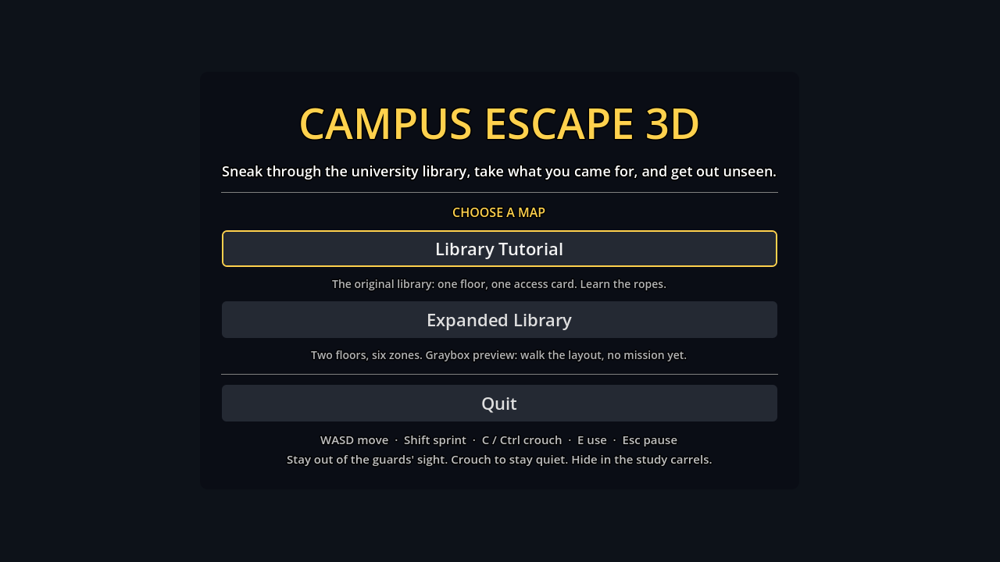

# Expanded Library — Phase 2: Multi-Map Integration

The main menu now offers both maps: the **Library Tutorial** and the **Expanded Library**.

Each map:
- loads its own scene;
- restarts into itself;
- returns to the menu;
- leaves nothing behind when it's left.

The tutorial scene and its behaviour are unchanged. The mission is not part of this phase.

## The existing flow, and why no new manager was needed

From the Phase 0 audit and re-checked here:

- **There are no autoloads.** Every system is a node inside a level scene and finds the others through its group (`GameFlow.find(node)` and the like).
- **Changing scene frees the whole map, systems included.** `get_tree().change_scene_to_file()` does this, so duplicates or stale references can only appear if a scene itself contains two copies of a system. The tests check for that.
- **`GameFlow.restart()` already reloads the scene it belongs to,** through `owner.scene_file_path`. In both maps GameFlow is a direct child of the level root, so Restart and Play again reload the right map without any change.
- **`GameFlow.go_to_main_menu()` already works from any level.**

So the feature only needed:
- a list of maps;
- a menu that offers them;
- the Expanded Library carrying the same runtime systems as the tutorial.

No global manager, autoload or new scene-loading code was added. The shared runtime sub-scene from the Phase 0 proposal (`level_runtime.tscn`) turned out not to be needed: the Expanded Library is generated, so the builder plays that role. That also means the `GameFlow.restart()` change it would have required (audit H6) is not needed either.

## What changed

| File | Change |
|---|---|
| `scripts/game/level_catalog.gd` (+ `.uid`) | **new.** `LevelCatalog`: the maps in menu order (id, title, description, scene) and small lookups. It is data, not a manager. |
| `scripts/ui/main_menu.gd` | one MenuStyle button per catalog map, each with a one-line description, under "CHOOSE A MAP"; Quit and the controls as before |
| `tools/expanded/build_expanded_graybox.gd` | the builder now adds the tutorial's level-wide systems to the Expanded Library (see below) |
| `scenes/level/expanded_library.tscn` | rebuilt with those systems. The layout and navmesh are unchanged (layout v0, 892 polygons) |
| `tests/map_selection_tests.gd` (+ `.uid`) | **new** (in the suite) |
| `tools/map_flow.gd` (+ `.uid`) | **new.** Repeated real map transitions |
| `tests/test_scene.gd` | runs the new tests; pass line ends "…, Expanded Library graybox, map selection)." |
| `tests/expanded_graybox_tests.gd` | the structure check now expects the runtime systems; "the menu still starts the tutorial" became "the tutorial is the default map, and the menu's Expanded Library entry loads this scene" |
| `tools/ci/run_tests.sh` | also runs `tools/map_flow.gd`; it fails on a failed check or on any ERROR / WARNING line in its output |
| `tools/ci/export_windows.sh` | the pack check also requires `scenes/level/expanded_library.tscn` |
| `README.md`, `docs/BUILD.md`, `docs/qa/REGRESSION_CHECKLIST.md`, `docs/expanded/LAYOUT.md` | how to run / choose a map, architecture, tests, the new A2b run and a manual "Map selection" row |

### The main menu

How the menu keeps its existing behaviour:
- **One button per map, in catalog order.** The **Library Tutorial** button comes first and has focus, so Enter starts the tutorial just as the old single Start button did. Up and Down move between the map buttons and Quit.
- **Old names kept.** `start_button` is still the tutorial's button and `start_game()` still starts the tutorial. The existing game-flow tests and `tools/qa_flow.gd` work unchanged.
- **New names.** `expanded_button` is the Expanded Library's button; `level_buttons` maps id → button; `start_level(id)` loads any catalog map.
- **One request only.** A second press while the scene is changing is ignored, as before.
- **Same style.** MenuStyle buttons and labels, with the same hover and click sounds.

### Shared systems in the Expanded Library

The tutorial has seven level-wide systems:
- StealthDirector, StealthHud, NoiseSystem and DetectionDebugHud;
- GameFlow, GameMenus and AudioDirector.

The Phase 1 graybox only had GameFlow and GameMenus. So:
- the pause menu was silent;
- footsteps made no sound or noise events;
- there was no stealth HUD.

The builder now adds all seven, with the same node names and scripts as the tutorial. They are added after the navmesh bake and outside the scene tree, so music and HUDs don't start while the tool runs.

The mission systems (ObjectiveManager, CheckpointManager, ObjectiveHud) are left for the mission phase. Every system that looks them up already handles their absence.

## Tests

The full output is in [`phase2/test_run.txt`](phase2/test_run.txt) and [`phase2/map_flow.log`](phase2/map_flow.log).

| Command | Result |
|---|---|
| `bash tools/ci/validate.sh` | `CHECK SCRIPTS PASSED (79 scripts)`, `VALIDATION PASSED` |
| `bash tools/ci/run_tests.sh` | `All tests passed (…, Expanded Library graybox, map selection)` with only the 8 expected warnings; `QA FLOW PASSED (15 checks, 4 levels loaded)`; `MAP FLOW PASSED (34 checks, 12 levels loaded, 3 cycles)` with no ERROR or WARNING lines; `TESTS PASSED` |
| `bash tools/ci/export_windows.sh` | `EXPORT PASSED`, with the Expanded Library in the pack |
| `godot --headless --path . --quit-after 300` (the normal entry point: the main menu) | exit 0, no ERROR or WARNING lines |
| `tools/map_flow.gd` with a window (Xvfb, 1280×720), screenshots in `phase2/` | `MAP FLOW PASSED`. The only messages are the VM's display and audio messages (V-Sync not supported, no sound device: "status < 0", dummy audio driver) |

**`tests/map_selection_tests.gd`** (scene changes stubbed):
- **Catalog:** both maps; unique ids; scenes that load; the tutorial first and equal to the scene the menu always started.
- **Menu:**
  - one button per map, in order;
  - Library Tutorial focused; Up/Down reach both map buttons and Quit;
  - each button requests its own scene exactly once, even when pressed again;
  - `start_game()` still starts the tutorial, an unknown map loads nothing, and Quit quits.
- **Each map, loaded twice:**
  - exactly one node in each system group (`game_flow`, `stealth_director`, `noise_system`, `audio_director`, `player`, plus `objective_manager` and `checkpoint_manager` in the tutorial only), and none elsewhere in the tree;
  - Restart requests the same map; Main menu requests the menu and unpauses;
  - signal connections are made once: `player_caught` 1; `level_reset` 2 in the tutorial (GameFlow and CheckpointManager) and 1 in the Expanded Library; `state_changed` 2. The counts are identical on the second load;
  - after leaving, the level, GameFlow and StealthDirector are freed and every group is empty.

**`tools/map_flow.gd`** (real scene changes, through the real buttons). It runs this sequence three times:
1. menu → Library Tutorial → Esc → Restart level → Esc → Main menu;
2. → Expanded Library → Esc → Restart level → Esc → Main menu;

and finally Quit (stubbed so the result can be printed). That is 34 checks over 12 level loads.

After every change it checks:
- the right scene;
- a new instance, with the previous one freed;
- PLAYING and unpaused;
- one of each system;
- the same connection counts as that map's first load;
- on the menu: no level system left, the Library Tutorial button focused, and node / orphan / root-child counts.

From cycle 1 to cycle 3 the menu stays at 17 nodes, 0 orphans and 1 root child.

**The tests catch the problem they guard against.** A second GameFlow was injected into the Expanded Library scene:
- `map_selection_tests` fails on the group count and the connection counts (6 failures);
- `map_flow` fails at every Expanded Library load. It also shows the real effect: with two GameFlows, Esc no longer pauses.

Pointing the Expanded Library entry at the wrong scene fails the catalog checks.

**Suite time:** `run_tests.sh` took 372 s (Phase 1: 356 s). The CI step limits are 1,200 s for the suite and 600 s for each flow run.

## Manual tests still required (Windows, Godot 4.7.2)

1. Press **F5**. The menu shows "CHOOSE A MAP" with **Library Tutorial** (focused) and **Expanded Library**. Check:
   - Up/Down/Enter work;
   - the mouse hover and click sounds play;
   - the text is readable at your resolution.
2. **Library Tutorial:** it plays as before. Esc → Restart level → the tutorial again; Esc → Main menu.
3. **Expanded Library:**
   - you start on the porch; the stealth HUD line shows; footsteps are audible;
   - Esc pauses with the menu sound;
   - Restart level → the Expanded Library again; Esc → Main menu.
4. Switch maps a few times. Watch the Output / console for errors.
5. **Exported build:** the same, from `CampusEscape3D.exe`.

None of these could be done here: this environment has no Windows machine, no interactive editor and no sound device.

## Acceptance criteria

| Criterion | Result | Evidence |
|---|---|---|
| Both maps can be selected from the main menu | **PASS** | menu tests; `map_flow` steps 3, 8, …; `phase2/main_menu.png` |
| Each option loads the correct scene | **PASS** | `map_flow`: `scene_file_path` checked after every selection |
| Both maps can be restarted | **PASS** | `map_flow`: Pause → Restart level, a new instance of the same map, ×3 per map |
| Returning to the menu works from both maps | **PASS** | `map_flow`: Pause → Main menu from both maps, ×3 |
| Repeated transitions leave no duplicate managers or stale references | **PASS** | one of each system after every load; previous scenes freed; connection counts unchanged; menu node count 17 → 17, orphans 0 → 0 |
| Existing tutorial functionality passes its regression tests | **PASS** | full suite (all Phase 1–14 tests), `qa_flow` 15/15 |
| No critical runtime errors | **PASS** | no ERROR or WARNING in the map-selection run or from the entry point; only the 8 expected test warnings in the suite |

## Known issues and limitations

- **The Expanded Library has no mission yet,** so it has no objectives, win screen, guards or checkpoints. The menu says "Graybox preview: walk the layout, no mission yet".
- **Linux VM only so far:** all results come from the headless runs and the software-rendered window. Windows, sound and feel need the manual checks above.
- **The menu always focuses the Library Tutorial,** even after returning from the Expanded Library. That is the old behaviour; remembering the last choice was not added.
- **Rebuilding the graybox regenerates the `.tscn`'s node ids,** so its diff in this phase is large. The layout data and navmesh are unchanged. The builder diff (`build_expanded_graybox.gd`) shows what actually changed.

## Recommended next phase

**The mission in the Expanded Library:**
- the five objectives with a per-level ObjectiveManager configuration (audit H2);
- the locked gates and the one-way shortcut. A blocking access door needs approval for the new physics layer (audit R8);
- checkpoints and the exit interaction;
- ObjectiveHud added through the builder.

The menu's description line would then drop "no mission yet".
