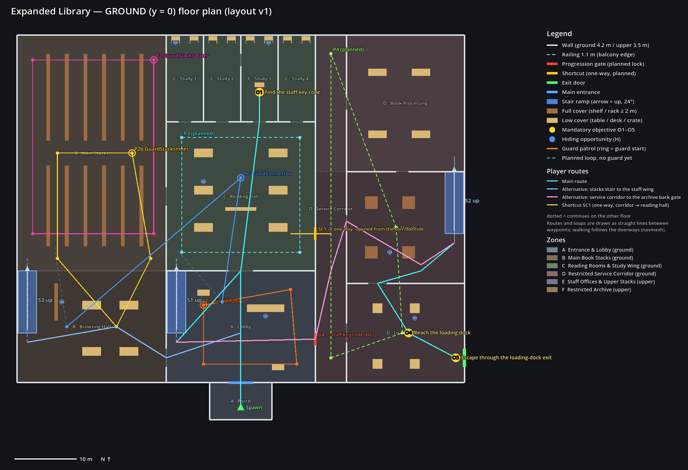
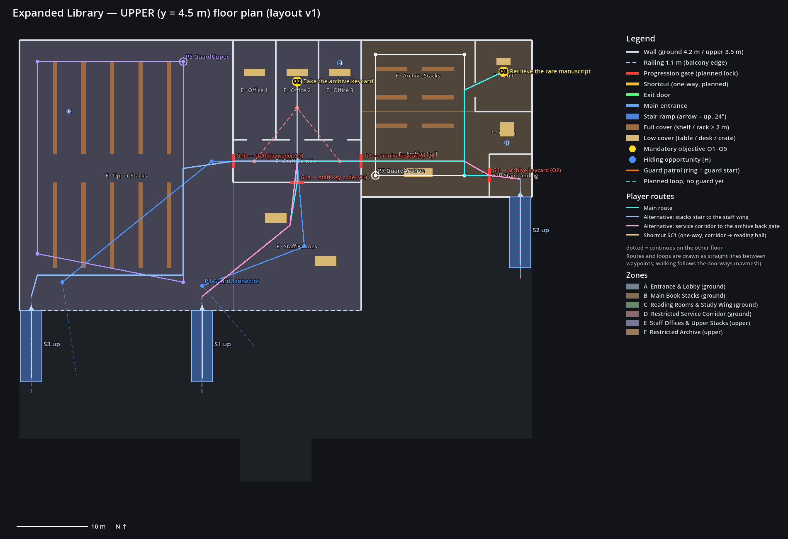

# Expanded Library — Phase 3: Navigation and Guard Patrols

The Expanded Library now has six patrolling guards. They use the existing guard scene and AI unchanged: the three states PATROL, INVESTIGATE and CHASE, with the same vision and hearing.

The navigation covers both floors and all three stairs. Every patrol loop completes without stuck events, in the tests and in a 900 s soak.

Two problems turned up and were fixed:
- **Guards stood still under path corners at the foot of a stair.** This was fixed in `scripts/npc/guard.gd`. The change leaves the tutorial's guards behaving exactly as before.
- **A stair handrail caught guards' shoulders.** It was rebuilt as vertical panels.

Layout version **v1** (see [`LEVEL_LOG.md`](LEVEL_LOG.md)).

| | |
|---|---|
|  |  |

## What was inspected

- **Navigation.** The Phase 1 navmesh: one NavigationRegion3D covering both floors, baked from static colliders on layer 1 with the tutorial's settings. Cell 0.25 m, agent radius 0.5 m and height 1.75 m. The ramps are 24°, so within the 45° limit.
- **Guard scene.** `NavigationAgent3D` with radius 0.4, height 1.8, path and target desired distance 0.5 m, avoidance on.
  - Avoidance is 2D. Godot ignores agents above or below an agent's own height, so guards on different floors don't push each other.
- **Patrols.** `PatrolRoute` and `PatrolPoint`, the same as in the tutorial.
- **AI.** `GuardStateMachine`, with perception through `GuardVision` (90° cone, 14 m, rays on the world and player layers) and `GuardHearing` (event radius, halved through anything on the world layer).

## Guards (layout data, built into the scene)

The patrols are level data in `tools/expanded/expanded_layout.gd` (`PATROLS`). The builder turns every loop that has a `"guard"` into a PatrolRoute plus a guard instance under `Guards/`, as in the tutorial.

| Guard | Loop | Floor | Length | Role |
|---|---|---|---|---|
| GuardLobby | P1 Lobby | ground | 51 m | lobby patrol |
| GuardStacksOuter | P2 Main Stacks | ground | 99 m | main stacks, outer aisles |
| GuardStacksInner | P2b Stacks Inner | ground | 76 m | main stacks, cross aisle and browsing hall |
| GuardUpper | P5 Upper Stacks | upper | 101 m | upper floor: both stair tops and G1b |
| GuardArchive | P7 Archive | upper | 59 m | archive hall and stacks |
| GuardConnector | P8 Connector | both | 180 m | connecting patrol: up S1, balcony, through G1a and G1b, down S3, back through the stacks |

That is the suggested distribution: one lobby, two in the main stacks, one upstairs, one in the archive, one connecting.

The spawn and porch are never seen. The restricted service corridor (P4) and the reading hall and staff corridor loops (P3, P6) stay planned without guards; P4 is for the mission phase. Each guard starts at its loop's first point, facing the second, with the default 2 s wait (1.5 s for the connector).

## Problems found and fixed

### 1. Guards stood still under a path corner at the foot of a stair

**Found by:** the new tour test. A guard sent from storage up S2 stopped at the foot of the ramp and waited until the stuck timeout, at every attempt.

**Cause:**
- `NavigationAgent3D` counts a path corner as reached within `path_desired_distance` (0.5 m), measured in 3D.
- On the ramps the navmesh surface sits up to about 0.55 m above the slope. This is the voxel quantisation of the bake; with cell height 0.25 m the error can be more than one cell.
- So a guard standing right under a corner was more than 0.5 m away from it and never "reached" it. Its horizontal steering toward the corner was zero, so it stood still.

**Fix** (`scripts/npc/guard.gd`):
- The new `_horizontal_to_next_corner()` notices when the next corner is within 0.15 m horizontally of the guard, i.e. straight above or below it.
- It remembers that corner as passed and steers to the next corner on the path.
- The remembered corners are cleared whenever the guard is given a new destination.

**Why the tutorial is unaffected.** Its navmesh sits 0.3 m above its single flat floor. The agent therefore counts a corner as reached as soon as the guard is within about 0.4 m horizontally, long before the guard could be within 0.15 m. The new branch cannot trigger there, and the full tutorial regression suite passes.

**Attempts that were rejected** (both tried and measured):
- **Raising the navmesh** by limiting the bake volume.
- **A per-guard `path_height_offset`.**

Both made guards cut corners by up to 0.5 m. They then clipped stair handrails and got stuck at the top of S1. They were reverted, so the navmesh uses the Phase 1 settings.

### 2. A stair handrail caught guards' shoulders

**Found by:** the same tour.

**Cause:** the v0 handrail on each stair's open side was one panel turned with the slope. A panel square to the slope leans downhill, so its upper edge stuck out about 0.4 m past the foot of the ramp. A guard turning onto the stair hit it.

**Fix** (builder): the handrail is now a balustrade of five vertical panels, each 1.0 m above the ramp, standing on the ramp's edge (`HANDRAIL_PANELS`). The navmesh was rebaked: 891 polygons, 2,805 m² on the ground floor and 1,663 m² upstairs.

**The fix is load-bearing.** With the guard fix reverted, the new tests fail 13 checks: the connector, the stair chase, the S2 crossing and the tour all stall on a ramp ([`v1/mutation_checks.txt`](v1/mutation_checks.txt)).

## Navigation checks

| Requirement | How it is checked | Result |
|---|---|---|
| Both floors have valid navigation | navmesh polygons on both floors and the ramps, none floating elsewhere; saved = fresh bake (graybox tests) | 2,805 + 1,663 m², saved 4,523.7 m² = fresh |
| Stair connections, floor transitions | each stair on its own, up and down (graybox tests); the connector's loop (up S1, down S3); the tour (up S2); crossing on S2 (both directions); the stair chase (up and down S1) | all pass |
| Around shelves, tables, obstacles | every room probe and shelf aisle reachable; the six loops through the stacks and archive aisles; the soak | 0 stuck in 900 s |
| Narrow corridors, doorways, restricted entrances | two guards head-on in a 2 m door (Study 3) and on a 3 m stair (S2); the tour through G1a, G1b, G2, G3, G4 and SC1 | all pass, 0 stuck |
| No unintended bypasses | the level is sealed: no path to points outside the building; nothing baked above the upper floor; the Phase 1 blocker rebakes still show the archive is only reachable through its gates | pass |
| Patrol points don't block routes | no patrol point within 2 m of any doorway or on a stair | pass |
| Rebake after geometry changes | the builder rebakes; the graybox test fails if the saved navmesh differs from a fresh bake by more than 0.5 m² | pass |

The gates are still open doorways: guards have the keys, and the player's locks are the mission phase. Guards walk through G1a, G1b, G2, G3, G4 and SC1 by design.

## Perception checks (existing rules, on the new map)

| Check | Setup | Result |
|---|---|---|
| Vision, open | guard in the stacks' cross aisle, player 13.5 m down the aisle | seen |
| Vision, wall or shelf | player behind a shelf row, inside the cone and range | not seen |
| Vision, floors | player on the upper floor, inside the cone and range, the slab between | not seen |
| Vision, balcony | guard in the lobby looking up: player at the railing / 3 m back | seen / hidden by the railing |
| Hearing, open | sprint 8 m away | investigated at an **estimate**, 0.2–3.5 m from the true spot, never exact |
| Hearing, wall | sprint 10.5 m away, behind the study wall | not heard (walls halve the 12 m range) |
| Hearing, floors | walking directly overhead / sprinting directly overhead | not heard / heard and investigated **upstairs** (the slab counts as a wall: 6 m range, the noise 2.9 m from the guard's ears) |
| Detection → pursuit → loss | player 9 m away in the open lobby, then hidden in Study 1 | CHASE → INVESTIGATE at the last seen spot (not the player's real position) → PATROL |
| Pursuit across floors | guard at the foot of S1, player at the top, then gone into the upper stacks | chases up S1, searches upstairs, walks back down to its post |

## Tests

The full output is in [`v1/test_run.txt`](v1/test_run.txt).

| Command | Result |
|---|---|
| `bash tools/ci/validate.sh` | `VALIDATION PASSED` |
| `bash tools/ci/run_tests.sh` | `All tests passed (…, Expanded Library graybox, map selection, Expanded Library guards)` with only the 8 expected warnings; `QA FLOW PASSED (15 checks)`; `MAP FLOW PASSED (34 checks)`, no ERROR or WARNING; 548 s |
| `bash tools/ci/export_windows.sh` | `EXPORT PASSED` |
| `tools/expanded/patrol_soak.gd -- --seconds=900 --scale=4` | 6 guards, 8–27 full loops each, **0 stuck, 0 state changes** ([`v1/soak/report.md`](v1/soak/report.md)) |

**`tests/expanded_ai_tests.gd`** (new, in the suite):
- **A. Navigation.**
  - Both floors are baked and the level is sealed (5 outside points unreachable).
  - Nothing is baked above the upper floor or outside the building.
  - Every patrol point is on the navmesh, at least 2 m from any doorway and not on a stair; every segment of every loop has a path.
- **B. All six guards run together** (time ×3, as in the soak):
  - each completes its loop in order;
  - 0 stuck; all stay in PATROL;
  - the connector reaches both floors;
  - nobody sees the player at the spawn.
- **C–F.** The perception table above.
- **G.** Head-on crossings in a 2 m door and on S2; the tour through every gate and S1, S2 and S3.

Existing tests changed:
- `tests/expanded_graybox_tests.gd` takes the guards out before its layout checks and real-input walk, as `qa_playthrough_tests` does in the tutorial. It also reads the patrol points from the layout data.
- `tests/test_scene.gd` runs the new module.

**Tutorial regression:** all Phase 1–14 tests pass with the `guard.gd` change, including the AI state, AI behaviour, guard, vision, hearing, stealth-loop, QA playthrough and benchmark-related tests. So do `qa_flow` and `map_flow`.

**Suite time:** 548 s (Phase 2: 372 s). The CI limit for the suite step is 1,200 s.

## "Meaningful stealth decisions" (soak measurement)

The soak samples the main route (spawn → O1 … O5) every metre. It records how often a guard could see a player there: 90° cone, 14 m, clear line of sight, the same geometry as GuardVision.

| Measure | Value |
|---|---|
| Route ever seen while standing | 81% of its metres |
| Watched less than 5% of the time | 40% of its metres |
| Mean exposure, standing / crouched | 8.5% / 7.9% |
| Most exposed metre | watched 27% of the time |

So most of the route is covered at some point, but no metre is watched more than about a quarter of the time. Every guarded place has gaps to wait for, and no patrol permanently blocks a mandatory route.

The tutorial's floor-wide figure is 10.3% mean exposure (`docs/level/v4`). Its tool measures the whole floor, not a route, so the numbers are indicative, not equal measures.

## Manual tests still required (Windows, Godot 4.7.2)

1. Open `scenes/level/expanded_library.tscn`, press **F6**, then **F3** to see the navmesh, the loops and the debug labels. Check:
   - all six guards walk their loops;
   - GuardConnector goes up S1 and comes down S3;
   - no guard stands still on a stair, in a doorway or against furniture.
2. Sprint near a guard: it shows "?", walks to roughly where you were, searches, and returns.
3. Get seen in the open lobby: "!", chase music, the guard runs. Break line of sight: it searches where it last saw you, then goes back to its loop.
4. From the lobby, stand at the balcony railing and then step back; check the lobby guard sees you only at the railing.
5. Play the tutorial: its guards behave as before.

These were not done here: this environment has no Windows machine, no interactive editor and no sound device.

## Acceptance criteria

| Criterion | Result | Evidence |
|---|---|---|
| Both floors have valid navigation | **PASS** | navmesh on both floors and the ramps; sealed; saved = fresh |
| Every required patrol route functions | **PASS** | 6 loops complete in order (test B); soak 8–27 loops each |
| Guards navigate intended stairs and passages | **PASS** | connector (S1 up, S3 down), tour (S2 up, every gate), crossings, stair chase |
| No critical navigation failures remain | **PASS** | the two failures found were fixed; 0 stuck in the tests and the soak |
| AI perception follows the existing rules | **PASS** | the perception table; no AI or perception rule changed |
| Relevant AI and navigation tests pass | **PASS** | full suite |
| No persistent stuck states block progression | **PASS** | 0 stuck events; patrol points clear of doors and stairs; peak route exposure 27% |
| The tutorial's AI passes its regression tests | **PASS** | full suite with the `guard.gd` change |

## Known issues and limitations

- **One shared-code change:** `scripts/npc/guard.gd` (`_horizontal_to_next_corner`). It is behaviour-neutral on the tutorial's flat floor (argued above, and the suite confirms it), but it is a change to the shared guard.
- **Hearing through the floor** follows the existing rule: a slab counts as one wall. A sprint directly above a guard (within 6 m) is heard and investigated upstairs; walking and crouching are not. Whether the slab should muffle more (audit R5) is a design decision for the balancing phase. It needs your approval because it would change GuardHearing.
- **Catching across floors** is not specially handled. `StealthDirector` catches on horizontal distance (1.2 m) plus sight (audit R6). No test or soak run produced a cross-floor catch, because the slab and railings block sight at those positions. A vertical limit is recommended before release and needs approval.
- **The cross-floor sight line over the balcony railing exists by design.** A guard downstairs sees you only right at the railing.
- **Restricted zone D has no guard yet** (P4 is planned for the mission phase), and the gates are not locked yet.
- **Linux VM only.** All runs are headless or software-rendered on Linux. Guard feel and sound on Windows are in the manual list.
- **Rebuilding the scene regenerates its node ids,** so its diff is large; the layout data and builder diffs show the real changes.

## Recommended next phase

**The mission:**
- the five objectives with a per-level objective list;
- locks on G1a, G1b, G4, G2 and G3 and the one-way shortcut SC1. This needs your decision on the access-door layer (audit R8);
- checkpoints, the exit interaction and ObjectiveHud;
- a guard for the restricted service corridor (P4).

The cross-floor catch limit (R6) could be decided at the same time.
